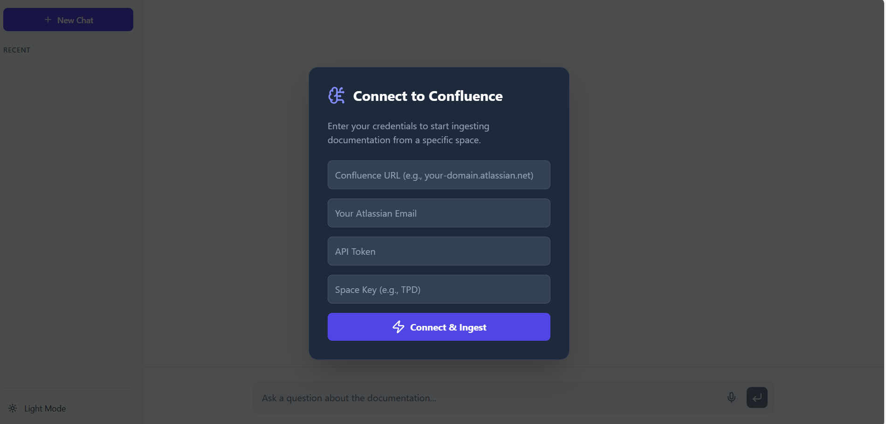
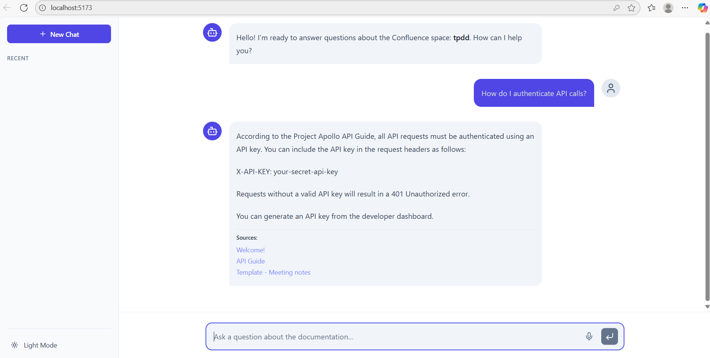

# 🧠 Confluence RAG Chatbot

This project is a powerful, self-hosted Retrieval-Augmented Generation (RAG) chatbot that connects to your personal or company's Confluence space. It allows you to ask questions in a natural, conversational way and receive answers based exclusively on the content of your documentation, complete with source links back to the original pages.

The entire system runs **100% locally**, using **Ollama** for the Language Model, ensuring your data and queries remain completely private.

---

## ✨ Key Features

- 🔗 **Connect to Your Confluence**: Securely connect to any Confluence space you have access to using an API token.  
- 🔒 **Private & Local**: Powered by Ollama and local vector storage (ChromaDB), meaning your documents and chats never leave your machine.  
- 📚 **Source-Cited Answers**: Every answer is accompanied by direct links to the Confluence pages used to generate it, ensuring trust and verifiability.  
- 🎨 **Modern UI**: A clean, user interface built with React and Tailwind CSS, featuring a dark mode toggle.  
- 🚀 **Robust Backend**: A resilient FastAPI backend handles data ingestion, document parsing, and the entire RAG pipeline.  

---

## 📸 Screenshots

Here are some screenshots of the application in action:

### Login/Connection Page


### Main Chat UI


---


## 🛠️ Technology Stack

| Area     | Technologies                                                                 |
|----------|------------------------------------------------------------------------------|
| Backend  | Python, FastAPI, LangChain, Ollama, ChromaDB, atlassian-python-api            |
| Frontend | React (Vite), Tailwind CSS, lucide-react, react-markdown                      |
| LLM      | Ollama (specifically tested with **llama3:8b**)                               |

---

## 🚀 Getting Started

Follow these steps to get the project running on your local machine.

### 1. Prerequisites
- **Ollama**: Make sure you have Ollama installed and running.  
- **Python & Node.js**: Python (3.9+) and Node.js (18+).  
- **Pull the LLM**:  
  ```bash
  ollama pull llama3:8b

### 2. Backend Setup
1.  **Navigate to the backend directory**:
    ```bash
    cd backend
    ```
2.  **Create and activate a virtual environment**:
    ```bash
    # For Windows
    python -m venv venv
    .\venv\Scripts\activate

    # For macOS/Linux
    python3 -m venv venv
    source venv/bin/activate
    ```
3.  **Install the required Python packages**:
    ```bash
    pip install "fastapi[all]" atlassian-python-api langchain langchain-community chromadb ollama beautifulsoup4 sentence-transformers
    ```
4.  **Run the backend server**:
    ```bash
    uvicorn main:app --reload
    ```
    The backend will be running at `http://127.0.0.1:8000`.

### 3. Frontend Setup
1.  **Open a new terminal** and navigate to the frontend directory:
    ```bash
    cd frontend
    ```
2.  **Install the required npm packages**:
    ```bash
    npm install
    ```
3.  **Run the frontend development server**:
    ```bash
    npm run dev
    ```
    The frontend will be accessible in your browser, usually at `http://localhost:5173`.

---

## 💬 How to Use
1.  **Open the App**: With both servers running, open your browser to the frontend URL.
2.  **Connect to Confluence**: You will be greeted by a connection modal. Fill in the following fields:
    - **Confluence URL**: Your base URL (e.g., `your-company.atlassian.net`).
    - **Your Atlassian Email**: The email associated with your Confluence account.
    - **API Token**: A [Confluence API token](https://support.atlassian.com/atlassian-account/docs/manage-api-tokens-for-your-atlassian-account/) for your account.
    - **Space Key**: The short identifier for the Confluence space you want to chat with (e.g., `TPD`).
3.  **Ingest Data**: Click **Connect & Ingest**. The backend will fetch, process, and index the documents from your specified space. You will see a success message in the chat when it's ready.
4.  **Start Chatting**: Ask any question related to the documentation in your Confluence space!

---

## ⚙️ Architecture & Data Flow

The application follows a standard RAG pattern. The **Ingestion** process is a one-time setup per Confluence space, which powers the **Chat** flow.

```mermaid
graph TD
    classDef frontendStyle fill:#D6EAF8,stroke:#3498DB,stroke-width:2px,color:#2874A6
    classDef backendStyle fill:#D5F5E3,stroke:#2ECC71,stroke-width:2px,color:#1E8449
    classDef serviceStyle fill:#FDEDEC,stroke:#E74C3C,stroke-width:2px,color:#B03A2E
    classDef userActionStyle fill:#FEF9E7,stroke:#F1C40F,stroke-width:2px,color:#B7950B

    subgraph Frontend [React UI]
        direction LR
        A[User Enters Credentials & Space Key]:::userActionStyle
        F[User Types Question]:::userActionStyle
        I{API Response}
        H[Render Formatted Answer & Sources]
        
        A --> B((POST /ingest));
        F --> G((POST /chat));
        I --> H;
    end

    subgraph Backend [FastAPI Server]
        direction TB
        subgraph Ingestion_Flow [Ingestion Flow]
            direction TB
            B --> D[Step 1 - Fetch & Parse Pages];
            D --> E[Step 2 - Chunk, Embed & Store];
        end
        
        subgraph Chat_Flow [Chat Flow]
            direction TB
            G --> J[Step 1 - Retrieve Relevant Chunks];
            J --> K[Step 2 - Augment Prompt with Chunks];
            K --> L[Step 3 - Generate Answer];
        end
        L --> I;
    end

    subgraph External_Services [External Services]
        direction TB
        Confluence[Confluence Cloud API]:::serviceStyle
        Ollama[Ollama llama3:8b]:::serviceStyle
    end

    D -- Fetches from --> Confluence;
    E -- Embeds using --> Ollama;
    J -- Queries --> E;
    L -- Answer generated by --> Ollama;

    class A,F,H frontendStyle;
    class D,E,J,K,L backendStyle;
    class I frontendStyle;
